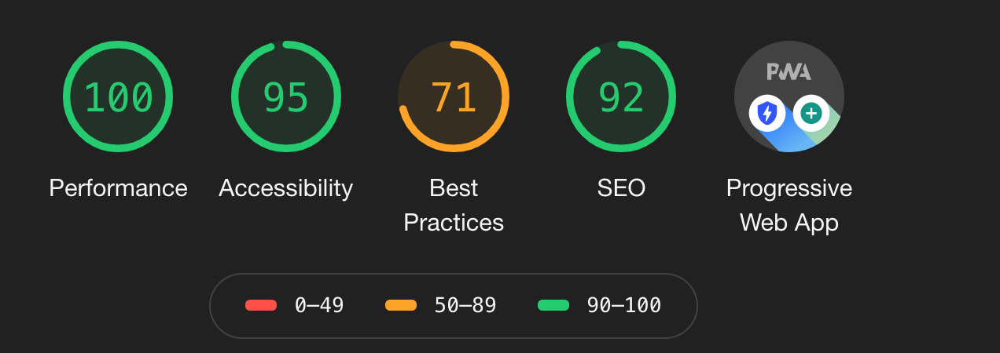

# Progressive Web App

## Description
A minimal full-stack PWA login/authorization app using the MERN stack (MongoDB for our database, Express and Node for a backend server, and React for a frontend client). 

## Installation
### Frontend
```npm install axios, jwt-decode, react-router-dom, react-scripts```

### Backend
```npm install bcryptjs, dotenv, express, jsonwebtoken, mongoose, http-server```

## Usage
- Register
- Log in
- Access protected pages only accessible to logged in users
- Showcase admin page to eligible users
- Stay logged in when they close the app or refresh the page
- Log out

## Screenshots


## Support
If you need help: Get in touch with me at ```waltermarikwa02@gmail.com``` or visit ```https://www.youtube.com/watch?v=7CqJlxBYj-M&t=1503s```.

## License

[MIT](https://choosealicense.com/licenses/mit/)
